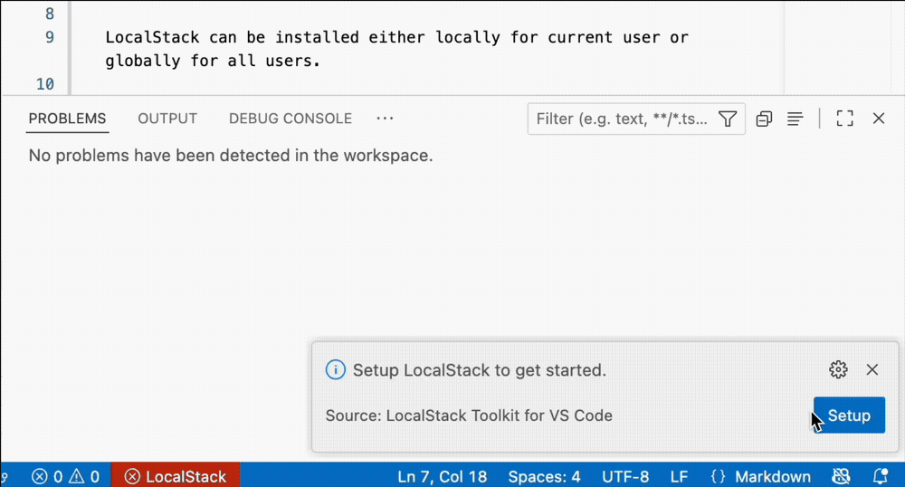

# LocalStack Toolkit for VS Code

The LocalStack Toolkit for VS Code enables you to install, configure, and run LocalStack without leaving VS Code.

## Install and configure LocalStack

The setup wizard ensures LocalStack is installed and configured for a seamless integration with AWS tools, like AWS CLI, SDKs, CDK.

LocalStack can be installed either locally for the current user or globally for all users.

You can start using LocalStack for free by signing up for a free account or signing into an existing one. The setup wizard facilitates this process and configures your authentication token required to start LocalStack.

The LocalStack Toolkit integrates seamlessly with AWS tools like the AWS CLI. It automatically configures a dedicated `localstack` AWS profile in your `.aws/config` and `.aws/credentials` files, if one is not already present.

## Run LocalStack

The LocalStack button in the VS Code status bar provides an instant view of LocalStack's runtime status, such as `stopped` or `running`.

The status bar button provides access to `Start` and `Stop` LocalStack commands. The status button turns red if LocalStack is not found or misconfigured.

## Viewing LocalStack logs

You can see LocalStack logs in the VS Code Output panel. Simply select LocalStack from the drop-down menu.

## `localstack` AWS profile

Once the profile is configured you can use it from your favorite AWS tools like AWS CLI, SDKs, CDK to deploy to and interact with LocalStack.

## Changelog

[Read our full changelog](./CHANGELOG.md) to learn about the latest changes in each release.

## Contributing

[Read our contributing guidelines](./CONTRIBUTING.md) to learn how you can help.

## Support

If you need help, [please read our support guidelines](./SUPPORT.md) for information on how to get in touch.
